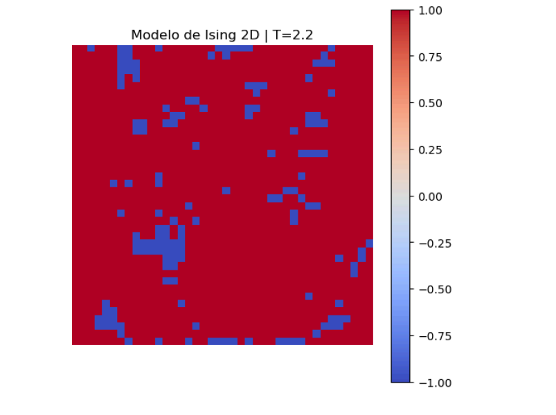
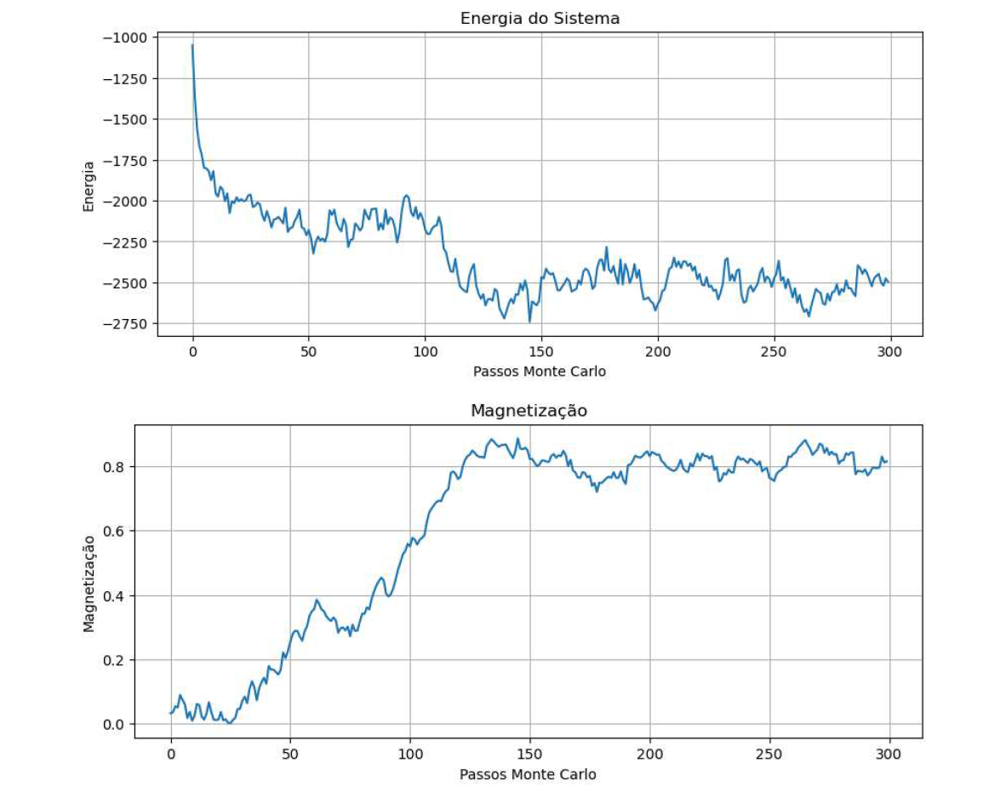
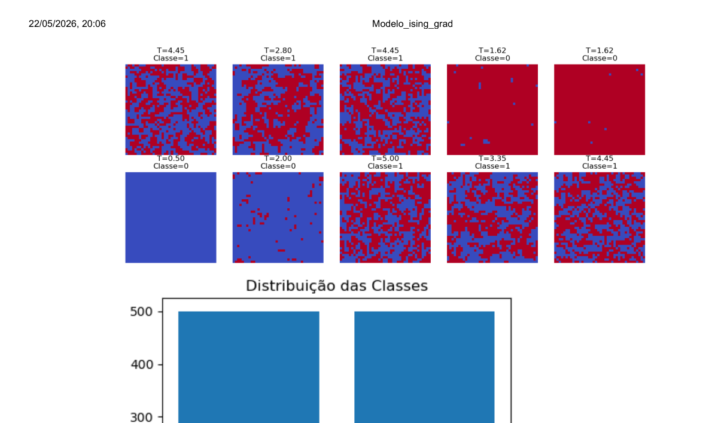
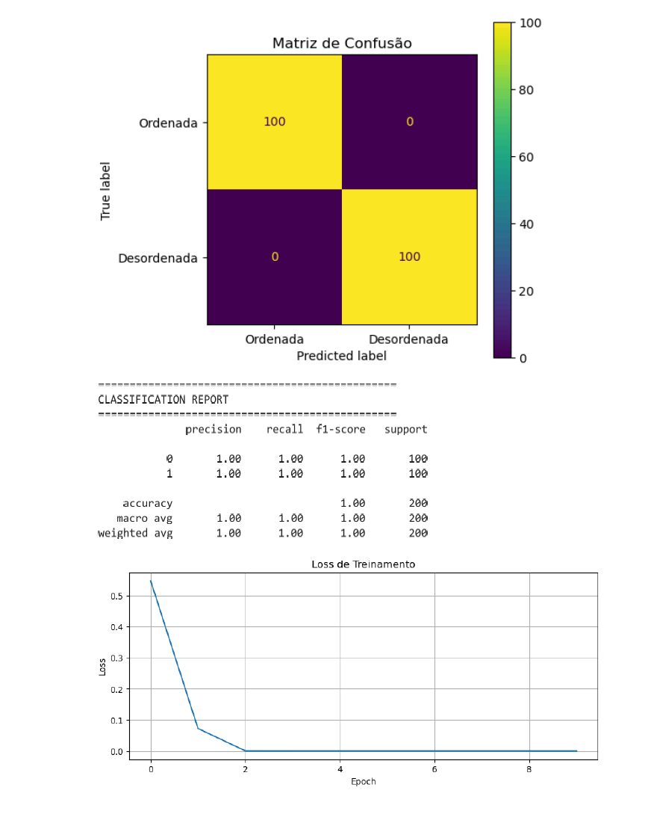
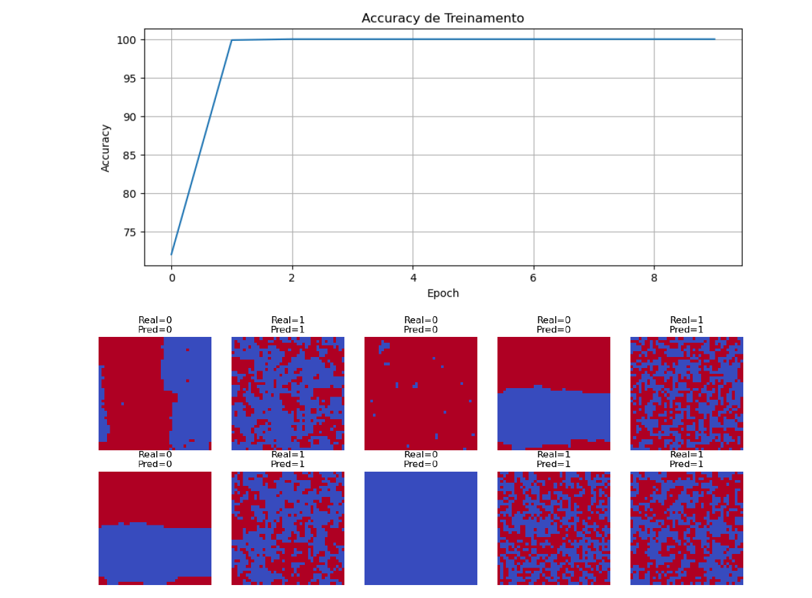
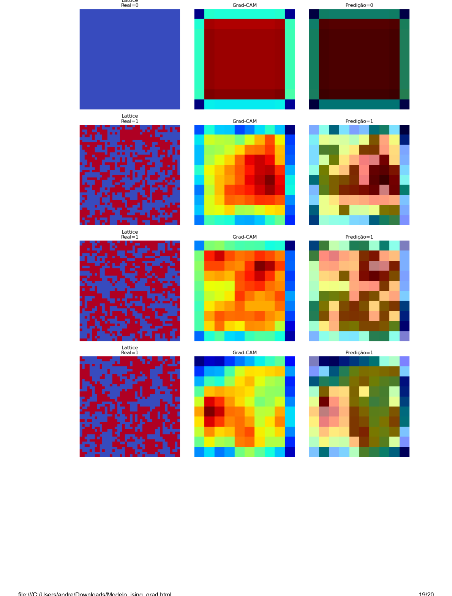

# Detecção de Transições de Fase no Modelo de Ising 2D com CNN e Grad-CAM

> **Autor:** André Luiz Magalhães de Oliveira

---

## 📋 Sumário

- [Visão Geral](#-visão-geral)
- [Fundamentação Teórica](#-fundamentação-teórica)
  - [Modelo de Ising 2D](#modelo-de-ising-2d)
  - [Simulação de Monte Carlo — Algoritmo de Metropolis](#simulação-de-monte-carlo--algoritmo-de-metropolis)
  - [Redes Neurais Convolucionais (CNNs)](#redes-neurais-convolucionais-cnns)
  - [Interpretabilidade via Grad-CAM](#interpretabilidade-via-grad-cam)
- [Pipeline do Projeto](#-pipeline-do-projeto)
- [Metodologia e Implementação](#-metodologia-e-implementação)
  - [Etapa 1 — Simulação do Modelo de Ising 2D](#etapa-1--simulação-do-modelo-de-ising-2d)
  - [Etapa 2 — Geração do Dataset](#etapa-2--geração-do-dataset)
  - [Etapa 3 — Arquitetura CNN em PyTorch](#etapa-3--arquitetura-cnn-em-pytorch)
  - [Etapa 4 — Treinamento e Avaliação](#etapa-4--treinamento-e-avaliação)
  - [Etapa 5 — Mapas de Ativação Grad-CAM](#etapa-5--mapas-de-ativação-grad-cam)
- [Resultados](#-resultados)
- [Requisitos e Instalação](#-requisitos-e-instalação)
- [Como Executar](#-como-executar)
- [Estrutura do Repositório](#-estrutura-do-repositório)
- [Referências](#-referências)

---

## 🔭 Visão Geral

Este projeto implementa um pipeline completo de **simulação estocástica + aprendizado profundo + inteligência artificial explicável (XAI)**, aplicado à detecção automática de transições de fase no **Modelo de Ising bidimensional**.

A abordagem integra três frentes:

1. **Simulação de Monte Carlo** (Algoritmo de Metropolis) para geração de configurações microscópicas de spins nas fases ordenada e desordenada.
2. **Rede Neural Convolucional (CNN)** treinada para classificar as fases termodinâmicas diretamente a partir das imagens de rede de spins, sem cálculo explícito de observáveis físicos.
3. **Grad-CAM** (*Gradient-weighted Class Activation Mapping*) para decodificar quais regiões espaciais da rede de spins a CNN utiliza em sua tomada de decisão, estabelecendo um vínculo direto entre ativações neurais e física de clusters de spin.

O modelo atingiu **100% de acurácia** na classificação das fases, e os mapas Grad-CAM revelaram que os filtros convolucionais aprendem espontaneamente conceitos físicos como **coerência de domínio ferromagnético** e **entropia de interface paramagnética** — sem supervisão explícita sobre esses conceitos.

---

## 📐 Fundamentação Teórica

### Modelo de Ising 2D

O Modelo de Ising 2D consiste em uma rede quadrada L × L de variáveis discretas de spin $s_i \in \{-1, +1\}$. O Hamiltoniano do sistema na ausência de campo externo é:

$$\mathcal{H} = -J \sum_{\langle i,j \rangle} s_i s_j$$

onde $J > 0$ é a constante de acoplamento ferromagnético e $\langle i,j \rangle$ indica a soma sobre pares de primeiros vizinhos. A probabilidade canônica de cada microestado $\sigma$ é dada pela distribuição de Boltzmann:

$$P(\sigma) = \frac{e^{-\beta \mathcal{H}(\sigma)}}{Z}, \quad \beta = \frac{1}{k_B T}$$

**Solução exata de Onsager (1944):** O modelo 2D exibe uma transição de fase contínua de segunda ordem na temperatura crítica:

$$T_c = \frac{2J}{k_B \ln(1 + \sqrt{2})} \approx 2{,}269 \; J/k_B$$

| Regime | Temperatura | Comportamento |
|--------|------------|---------------|
| **Fase Ordenada** (Ferromagnética) | $T < T_c$ | Quebra espontânea de simetria; magnetização $\langle M \rangle \neq 0$ |
| **Ponto Crítico** | $T = T_c \approx 2{,}269$ | Flutuações de escala infinita; clusters fractais |
| **Fase Desordenada** (Paramagnética) | $T > T_c$ | Dominância de flutuações térmicas; $\langle M \rangle = 0$ |

---

### Simulação de Monte Carlo — Algoritmo de Metropolis

Dado o espaço de estados de escala $2^{L \times L}$, a função de partição $Z$ é computacionalmente intratável de forma direta. O **Algoritmo de Metropolis** realiza amostragem de importância no ensemble canônico, obedecendo à condição de balanço detalhado.

**Regra de aceitação de Metropolis:**

$$W(s_i \to -s_i) = \min\!\left(1,\; e^{-\beta \Delta E}\right)$$

onde $\Delta E = E_\text{nova} - E_\text{atual} = 2J \, s_i \sum_{\delta} s_{i+\delta}$ é a variação de energia da inversão local do spin $i$.

Cada **Passo Monte Carlo (MCS)** consiste em $L^2$ tentativas de inversão, garantindo que cada spin tenha, em média, uma oportunidade de atualização. A termalização é atingida após um número suficiente de MCS, a partir do qual o sistema flutua ao redor do equilíbrio termodinâmico.

---

### Redes Neurais Convolucionais (CNNs)

CNNs são arquiteturas profundas otimizadas para extração hierárquica de feições espaciais em dados bidimensionais. A operação de convolução discreta é definida por:

$$S(i,j) = (I * K)(i,j) = \sum_m \sum_n I(i-m,\, j-n)\, K(m,n)$$

onde $I$ é a matriz de entrada (rede de spins) e $K$ é o kernel de pesos aprendíveis.

**Componentes da arquitetura utilizada:**

| Componente | Função |
|-----------|--------|
| `Conv2d` | Extração de feições locais via kernels 3×3 |
| `ReLU` | Não-linearidade: $f(x) = \max(0, x)$ |
| `MaxPool2d` | Redução de dimensionalidade e invariância local |
| `Dropout` | Regularização para mitigação de overfitting |
| `Linear` | Classificador final nas representações latentes |

---

### Interpretabilidade via Grad-CAM

O **Grad-CAM** (*Gradient-weighted Class Activation Mapping*) produz mapas de relevância espacial retroprojetando os gradientes de uma classe-alvo até a última camada convolucional.

**Peso de importância da k-ésima feature map para a classe c:**

$$\alpha_k^c = \frac{1}{Z} \sum_u \sum_v \frac{\partial Y^c}{\partial A_{uv}^k}$$

**Mapa de ativação final:**

$$L_{\text{Grad-CAM}}^c = \text{ReLU}\!\left(\sum_k \alpha_k^c \, A^k\right)$$

A aplicação da ReLU garante que o mapa capture exclusivamente as feições com influência positiva direta no score da classe analisada. O resultado é um **mapa térmico** sobreposto à rede de spins original, revelando as regiões espaciais decisivas para a classificação.

---

## 🔄 Pipeline do Projeto

```
┌─────────────────────────────────────────────────────────────────────┐
│                        PIPELINE COMPLETO                            │
│                                                                     │
│  ┌──────────────┐    ┌──────────────┐    ┌────────────────────────┐ │
│  │  Simulação   │    │  Dataset     │    │   Rede Neural CNN      │ │
│  │  Metropolis  │───▶│  L=40, 1000  │───▶│   3 blocos conv.       │ │
│  │  Monte Carlo │    │  amostras    │    │   PyTorch              │ │
│  └──────────────┘    └──────────────┘    └────────────┬───────────┘ │
│         │                                             │             │
│         ▼                                             ▼             │
│  ┌──────────────┐                        ┌────────────────────────┐ │
│  │  Observáveis │                        │      Grad-CAM          │ │
│  │  E(t), M(t)  │                        │  Mapas de Ativação     │ │
│  │  Termalização│                        │  Interpretabilidade    │ │
│  └──────────────┘                        └────────────────────────┘ │
└─────────────────────────────────────────────────────────────────────┘
```

---

## 🛠 Metodologia e Implementação

### Etapa 1 — Simulação do Modelo de Ising 2D

**Parâmetros físicos e computacionais:**

```python
L = 40          # Tamanho linear da rede quadrada
J = 1.0         # Constante de acoplamento ferromagnético
TC = 2.269      # Temperatura crítica de Onsager
SEED = 42       # Semente de reprodutibilidade
```

O sistema é simulado em `T = 2.2` (próximo à criticalidade), partindo de um estado totalmente desordenado (aleatório). A evolução temporal dos observáveis macroscópicos — energia interna $\mathcal{H}$ e magnetização absoluta $|M|$ — é monitorada ao longo de **300 passos de Monte Carlo**.

**Configuração da rede de spins em T = 2.2:**

> *Figura 1 — Snapshot da rede de spins 40×40 após termalização em T = 2.2. Vermelho: spin +1, Azul: spin -1. Observa-se a formação de domínios ferromagnéticos com flutuações características da criticalidade.*



**Evolução dos observáveis durante a termalização:**

> *Figura 2 — (Superior) Curva de decaimento da energia interna do sistema ao longo dos 300 passos de Monte Carlo. (Inferior) Crescimento da magnetização absoluta indicando a formação de ordem ferromagnética de longo alcance.*



**Valores típicos durante a evolução estocástica:**

| Métrica Termodinâmica | Estado Inicial (Passo 0) | Fase Intermediária (Passo 50) | Equilíbrio (Passo 300) |
|----------------------|--------------------------|-------------------------------|------------------------|
| Energia Interna $\mathcal{H}$ | ≈ −100 J | ≈ −1.800 J | ≈ −2.500 J |
| Magnetização Absoluta $|M|$ | ≈ 0,05 | ≈ 0,35 | ≈ 0,82 |

A queda monotônica da energia nos primeiros 100 MCS evidencia a eficiência do algoritmo Metropolis na minimização da energia livre de Helmholtz. O platô de $|M| \approx 0{,}82$ confirma a **quebra espontânea de simetria** e a estabilização de domínios macroscópicos ferromagnéticos.

---

### Etapa 2 — Geração do Dataset

O dataset é composto por **1.000 amostras** de configurações de spins 40×40, geradas a partir de dois subconjuntos de temperatura correspondentes às duas fases termodinâmicas bem separadas da criticalidade:

| Classe | Label | Intervalo de Temperatura | Nº de Pontos | Amostras por Ponto |
|--------|-------|--------------------------|-------------|-------------------|
| **Fase Ordenada** (Ferromagnética) | 0 | $T \in [0{,}5;\, 2{,}0]$ | 5 | 100 |
| **Fase Desordenada** (Paramagnética) | 1 | $T \in [2{,}8;\, 5{,}0]$ | 5 | 100 |

> ⚠️ **Nota metodológica:** A janela crítica $2{,}0 < T < 2{,}8$ foi **intencionalmente excluída** do dataset de treinamento, eliminando o ruído gerado pelas flutuações de escala infinita e pelo *finite-size scaling effect*. Isso permite que a rede mapeie as características geométricas extremas de cada fase de forma limpa.

**Protocolo de amostragem:**
- **Termalização:** 300 MCS iniciais descartados (burn-in)
- **Decorrelação:** amostras salvas a cada 5 MCS para contornar o tempo de autocorrelação crítica
- **Formato final do tensor:** `(1000, 1, 40, 40)` — 1000 amostras, 1 canal, 40×40 pixels

**Exemplos de configurações e distribuição das classes:**

> *Figura 3 — (Superior) Mosaico de 10 configurações de spins amostradas: fases desordenadas à esquerda (T alto, mistura caótica de domínios) e fases ordenadas à direita (T baixo, dominância ferromagnética). (Inferior) Histograma de distribuição — 500 amostras da fase ordenada (Classe 0) e 500 da fase desordenada (Classe 1), balanceamento perfeito.*



---

### Etapa 3 — Arquitetura CNN em PyTorch

As configurações de spin são normalizadas do intervalo $[-1, +1]$ para $[0, 1]$ via transformação linear $x \mapsto (x+1)/2$ e redimensionadas para o formato de entrada `(1, 40, 40)`.

**Arquitetura `IsingCNN`:**

```python
class IsingCNN(nn.Module):
    def __init__(self):
        super(IsingCNN, self).__init__()
        self.features = nn.Sequential(
            nn.Conv2d(1, 16, kernel_size=3, padding=1),
            nn.ReLU(),
            nn.MaxPool2d(2),          # 40×40 → 20×20

            nn.Conv2d(16, 32, kernel_size=3, padding=1),
            nn.ReLU(),
            nn.MaxPool2d(2),          # 20×20 → 10×10

            nn.Conv2d(32, 64, kernel_size=3, padding=1),
            nn.ReLU(),
            nn.MaxPool2d(2)           # 10×10 → 5×5
        )
        self.classifier = nn.Sequential(
            nn.Flatten(),
            nn.Linear(64 * 5 * 5, 128),
            nn.ReLU(),
            nn.Dropout(0.3),
            nn.Linear(128, 2)
        )
```

**Fluxo dimensional pelo backbone convolucional:**

```
Entrada:  (B, 1,  40, 40)
Block 1:  (B, 16, 20, 20)   ← Conv(1→16) + ReLU + MaxPool2d
Block 2:  (B, 32, 10, 10)   ← Conv(16→32) + ReLU + MaxPool2d
Block 3:  (B, 64, 5,  5 )   ← Conv(32→64) + ReLU + MaxPool2d
Flatten:  (B, 1600)
FC-128:   (B, 128)           ← Linear + ReLU + Dropout(0.3)
Saída:    (B, 2)             ← Linear (logits das 2 classes)
```

**Hiperparâmetros de treinamento:**

| Hiperparâmetro | Valor |
|---------------|-------|
| Otimizador | Adam |
| Taxa de aprendizado | 0.001 |
| Função de perda | CrossEntropyLoss |
| Batch size | 64 |
| Épocas | 10 |
| Split treino/teste | 80% / 20% |
| Dropout | 0.3 |

---

### Etapa 4 — Treinamento e Avaliação

**Evolução do treinamento por época:**

| Época | Loss | Acurácia |
|-------|------|----------|
| 1/10 | 0.5473 | 72,00% |
| 2/10 | 0.0722 | 99,88% |
| 3/10 | 0.0001 | 100,00% |
| 4–10/10 | 0.0000 | **100,00%** |

A convergência rápida a partir da 2ª época reflete a alta separabilidade topológica das duas fases no espaço de feições convolucionais.

**Matriz de Confusão, Relatório de Classificação e Curva de Loss:**

> *Figura 5 — (Superior) Matriz de confusão no conjunto de teste: 100/100 amostras ordenadas e 100/100 desordenadas classificadas corretamente, zero erros. (Meio) Relatório completo de classificação com precisão, recall e F1-score = 1,00 para ambas as classes. (Inferior) Decaimento da Cross-Entropy Loss ao longo das 10 épocas — queda abrupta entre épocas 1 e 3.*



**Curva de Acurácia e Predições no Conjunto de Teste:**

> *Figura 6 — (Superior) Evolução da acurácia por época — a rede atinge 100% já na 3ª época. (Inferior) Grade de 10 configurações de spins do conjunto de teste com rótulos reais (`Real`) e predições da CNN (`Pred`). Todas as classificações estão corretas.*



**Relatório estatístico de classificação:**

| Fase Alvo | Precisão | Recall | F1-Score | Suporte |
|-----------|----------|--------|----------|---------|
| Classe 0 — Ordenada (Ferromagnética) | 1,00 | 1,00 | 1,00 | 100 |
| Classe 1 — Desordenada (Paramagnética) | 1,00 | 1,00 | 1,00 | 100 |
| **Média Global (Macro Average)** | **1,00** | **1,00** | **1,00** | **200** |

---

### Etapa 5 — Mapas de Ativação Grad-CAM

Para cada amostra analisada, são exibidas três representações:

1. **Lattice original** — configuração de spins 40×40 (vermelho: +1, azul: −1)
2. **Mapa Grad-CAM** — mapa térmico de relevância espacial (vermelho: alta ativação, azul: baixa ativação)
3. **Sobreposição** — fusão do mapa Grad-CAM sobre a rede de spins para localização visual das regiões decisivas

**Mapas Grad-CAM por classe:**

> *Figura 9 — Resultados Grad-CAM para 4 amostras (1 ordenada + 3 desordenadas). **Linha 1 (Real=0, Ordenada):** o mapa de ativação concentra-se no interior do bulk ferromagnético homogêneo, ignorando as bordas periódicas — a rede reconhece a uniformidade de alinhamento como assinatura da fase de baixa temperatura. **Linhas 2–4 (Real=1, Desordenadas):** a atenção distribui-se de forma difusa e fragmentada, com picos nas regiões de alta frequência de transição entre spins vizinhos — a rede detecta a entropia geométrica local característica da fase paramagnética.*



**Interpretação física dos mapas Grad-CAM:**

| Fase | Padrão de Ativação Grad-CAM | Interpretação Física |
|------|----------------------------|----------------------|
| **Ordenada** ($T < T_c$) | Alta ativação no bulk ferromagnético; baixa nas bordas | A CNN reconhece a **coerência espacial de spins** como assinatura da ordem de longo alcance |
| **Desordenada** ($T > T_c$) | Ativação difusa e granular, com picos nas interfaces de domínio | A CNN detecta a **alta densidade de fronteiras de domínio** e a **entropia geométrica local** |

Este resultado demonstra que a CNN **aprendeu espontaneamente** conceitos físicos reais — sem que esses conceitos tenham sido explicitamente fornecidos como rótulos durante o treinamento.

---

## 📊 Resultados

### Resumo Consolidado

| Métrica | Resultado |
|---------|-----------|
| Acurácia no conjunto de teste | **100,00%** |
| F1-Score (macro average) | **1,00** |
| Épocas até convergência total | **3** |
| Total de amostras de treino | 800 |
| Total de amostras de teste | 200 |
| Arquitetura | CNN 3 blocos conv. + FC |
| Parâmetros treináveis | ~210k |

### Conclusões Físicas

1. **Validação da separabilidade de fases:** A CNN aprendeu a discriminar perfeitamente as fases termodinâmicas do Modelo de Ising 2D a partir de imagens brutas de spins, sem cálculo explícito de observáveis como magnetização ou susceptibilidade.

2. **Física emergente nos filtros convolucionais:** Os mapas Grad-CAM revelaram que os filtros da última camada convolucional sintonizam sua resposta com:
   - **Fase ordenada:** Coerência e homogeneidade espacial dos domínios ferromagnéticos.
   - **Fase desordenada:** Densidade e fragmentação das fronteiras de domínio.

3. **XAI como ponte física:** A metodologia Grad-CAM estabelece um vínculo verificável entre representações latentes neurais e conceitos físicos concretos, desmistificando a natureza de "caixa-preta" dos modelos de aprendizado profundo.

4. **Perspectivas futuras:** Esta abordagem é diretamente extensível a sistemas mais complexos como *spin glasses*, modelos frustrados e sistemas quânticos, onde os parâmetros de ordem não são conhecidos a priori.

---

## 💻 Requisitos e Instalação

### Dependências

```bash
Python >= 3.9
torch >= 2.0.0
numpy >= 1.24.0
matplotlib >= 3.7.0
scikit-learn >= 1.2.0
tqdm >= 4.65.0
```

### Instalação

```bash
# Clone o repositório
git clone https://github.com/<seu-usuario>/ising-cnn-gradcam.git
cd ising-cnn-gradcam

# Crie e ative um ambiente virtual (recomendado)
python -m venv venv
source venv/bin/activate        # Linux/macOS
# venv\Scripts\activate         # Windows

# Instale as dependências
pip install -r requirements.txt
```

### Suporte a GPU (opcional)

O código detecta automaticamente a disponibilidade de CUDA:

```python
DEVICE = torch.device("cuda" if torch.cuda.is_available() else "cpu")
```

Para treinamento em GPU, instale a versão CUDA do PyTorch conforme as instruções em [pytorch.org](https://pytorch.org).

---

## ▶️ Como Executar

### Execução completa (pipeline integrado)

```bash
python Modelo_ising_grad.py
```

O script executa sequencialmente as 4 etapas:

```
============================================================
ETAPA 1 — SIMULAÇÃO DO MODELO DE ISING
============================================================
[Gera snapshot em T=2.2, plota energia e magnetização vs MCS]

============================================================
ETAPA 2 — GERAÇÃO DO DATASET
============================================================
[Amostra 1000 configurações nas fases ordenada e desordenada]
Dataset final: (1000, 1, 40, 40)

============================================================
ETAPA 3 — CNN
============================================================
Epoch 1/10  | Loss=0.5473 | Acc=72.00%
Epoch 2/10  | Loss=0.0722 | Acc=99.88%
...
Epoch 10/10 | Loss=0.0000 | Acc=100.00%

============================================================
ETAPA 4 — GRAD-CAM
============================================================
[Gera mapas de ativação para amostras selecionadas]
```

Todos os gráficos são salvos automaticamente na pasta `results/`.

### Execução via Jupyter Notebook

```bash
jupyter notebook Modelo_ising_grad.ipynb
```

---

## 📁 Estrutura do Repositório

```
ising-cnn-gradcam/
│
├── Modelo_ising_grad.py          # Script principal (pipeline completo)
├── Modelo_ising_grad.ipynb       # Notebook Jupyter com outputs
│
├── requirements.txt              # Dependências Python
├── README.md                     # Este arquivo
│
├── results/                      # Saídas geradas automaticamente
│   ├── ising_snapshot_T2.2.png   # Snapshot da rede em T=2.2
│   ├── energia_magnetizacao.png  # Curvas de termalização
│   ├── dataset_amostras.png      # Mosaico de amostras do dataset
│   ├── distribuicao_classes.png  # Histograma de classes
│   ├── loss_treinamento.png      # Curva de loss por época
│   ├── accuracy_treinamento.png  # Curva de acurácia por época
│   ├── matriz_confusao.png       # Matriz de confusão no teste
│   ├── predicoes_teste.png       # Grade de predições individuais
│   └── gradcam_resultados.png    # Mapas de ativação Grad-CAM
│
└── figures/                      # Figuras para o README
    └── ...
```

---

## 📚 Referências

As referências estão organizadas por tema. O BibTeX completo de cada entrada encontra-se ao final desta seção.

---

### Física Estatística e Modelo de Ising

**[1]** ISING, E. **Beitrag zur Theorie des Ferromagnetismus**. *Zeitschrift für Physik*, v. 31, n. 1, p. 253–258, 1925.
> Artigo original de Ernst Ising propondo o modelo unidimensional de spins interagentes. Embora o resultado 1D não apresente transição de fase, o modelo tornou-se o paradigma central da física estatística computacional.

**[2]** ONSAGER, L. **Crystal statistics. I. A two-dimensional Ising model with an order-disorder transition**. *Physical Review*, v. 65, n. 3–4, p. 117–149, 1944.
> Solução analítica exata do modelo de Ising 2D em campo nulo. Onsager demonstrou a existência de transição de fase de segunda ordem na temperatura crítica $T_c = 2J / [k_B \ln(1+\sqrt{2})] \approx 2{,}269\,J/k_B$, um dos resultados mais importantes da física teórica do século XX.

**[3]** METROPOLIS, N. et al. **Equation of state calculations by fast computing machines**. *The Journal of Chemical Physics*, v. 21, n. 6, p. 1087–1092, 1953.
> Artigo fundacional do Algoritmo de Metropolis. Introduziu a amostragem de importância no ensemble canônico via cadeias de Markov, viabilizando simulações de equilíbrio termodinâmico em sistemas de muitos corpos.

**[4]** NEWMAN, M. E. J.; BARKEMA, G. T. **Monte Carlo Methods in Statistical Physics**. Oxford: Oxford University Press, 1999.
> Referência textbook completa sobre métodos de Monte Carlo em física estatística. Cobre o algoritmo de Metropolis, algoritmos de cluster (Wolff, Swendsen-Wang), análise de autocorrelação e *finite-size scaling*.

**[5]** HUANG, K. **Statistical Mechanics**. 2. ed. New York: Wiley, 1987.
> Texto clássico de mecânica estatística. Apresenta a derivação do ensemble canônico, funções de partição, teoria de Landau para transições de fase e o tratamento formal dos fenômenos críticos e expoentes críticos universais.

---

### Machine Learning Aplicado à Física

**[6]** CARRASQUILLA, J.; MELKO, R. G. **Machine learning phases of matter**. *Nature Physics*, v. 13, n. 5, p. 431–434, 2017.
> Trabalho pioneiro que demonstrou que redes neurais simples podem aprender a distinguir fases termodinâmicas ordenadas e desordenadas do Modelo de Ising diretamente a partir de configurações de spins, sem supervisão explícita sobre os parâmetros de ordem.

**[7]** MEHTA, P. et al. **A high-bias, low-variance introduction to Machine Learning for physicists**. *Physics Reports*, v. 810, p. 1–124, 2019.
> Revisão extensa e acessível sobre aprendizado de máquina escrita por e para físicos. Cobre redes neurais, aprendizado não supervisionado, máquinas de Boltzmann restritas e sua relação com mecânica estatística e teoria de campo.

**[8]** TANAKA, A.; TOMIYA, A. **Detection of phase transition via convolutional neural networks**. *Journal of the Physical Society of Japan*, v. 86, n. 6, p. 063001, 2017.
> Aplica CNNs ao Modelo de Ising 2D para detecção de transições de fase, investigando a influência da arquitetura e dos dados de treinamento na localização da temperatura crítica. Contexto direto para o presente trabalho.

**[9]** REM, B. S. et al. **Identifying quantum phase transitions using artificial neural networks on experimental data**. *Nature Physics*, v. 15, p. 917–920, 2019.
> Extensão da metodologia de ML para detecção de transições de fase em dados experimentais quânticos reais, demonstrando a robustez da abordagem além de simulações computacionais.

---

### Redes Neurais Convolucionais e Aprendizado Profundo

**[10]** LECUN, Y.; BENGIO, Y.; HINTON, G. **Deep learning**. *Nature*, v. 521, n. 7553, p. 436–444, 2015.
> Artigo de revisão seminal sobre aprendizado profundo, cobrindo a motivação das CNNs, redes recorrentes e representações hierárquicas de feições. Ponto de entrada essencial para qualquer trabalho com deep learning.

**[11]** LECUN, Y. et al. **Gradient-based learning applied to document recognition**. *Proceedings of the IEEE*, v. 86, n. 11, p. 2278–2324, 1998.
> Artigo original apresentando a arquitetura LeNet e os fundamentos das redes neurais convolucionais: convolução, pooling, compartilhamento de pesos e invariância por translação. Base teórica da arquitetura `IsingCNN` utilizada neste trabalho.

**[12]** KINGMA, D. P.; BA, J. **Adam: A method for stochastic optimization**. In: *International Conference on Learning Representations (ICLR)*, 2015.
> Apresenta o otimizador Adam, utilizado no treinamento da CNN deste projeto. Combina as vantagens do RMSProp e do momento com taxas de aprendizado adaptativas por parâmetro.

**[13]** SRIVASTAVA, N. et al. **Dropout: A simple way to prevent neural networks from overfitting**. *Journal of Machine Learning Research*, v. 15, n. 1, p. 1929–1958, 2014.
> Artigo original do Dropout, técnica de regularização utilizada na camada totalmente conectada da `IsingCNN` (taxa 0,3). Demonstra que o desligamento aleatório de neurônios equivale a um ensemble implícito de redes menores.

**[14]** PASZKE, A. et al. **PyTorch: An imperative style, high-performance deep learning library**. *Advances in Neural Information Processing Systems*, v. 32, p. 8026–8037, 2019.
> Artigo descrevendo a biblioteca PyTorch, framework utilizado para construção, treinamento e inferência da CNN neste projeto. Destaca o design orientado à execução dinâmica de grafos computacionais (*define-by-run*).

---

### Interpretabilidade e XAI (Explainable AI)

**[15]** SELVARAJU, R. R. et al. **Grad-CAM: Visual explanations from deep networks via gradient-based localization**. In: *Proceedings of the IEEE International Conference on Computer Vision (ICCV)*, p. 618–626, 2017.
> Artigo original do Grad-CAM. Propõe o uso dos gradientes da classe-alvo propagados até a última camada convolucional para gerar mapas de ativação espacialmente localizados, sem modificações na arquitetura da rede.

**[16]** ZEILER, M. D.; FERGUS, R. **Visualizing and understanding convolutional networks**. In: *European Conference on Computer Vision (ECCV)*, p. 818–833, 2014.
> Trabalho fundacional em interpretabilidade de CNNs. Introduz a técnica de *deconvolution* para visualizar quais padrões de entrada maximizam a ativação de filtros convolucionais específicos, motivando toda a linha de pesquisa em XAI para visão computacional.

**[17]** SAMEK, W.; MÜLLER, K.-R. **Towards explainable artificial intelligence**. In: SAMEK, W. et al. (eds.). *Explainable AI: Interpreting, Explaining and Visualizing Deep Learning*. Lecture Notes in Computer Science, v. 11700. Springer, 2019. p. 5–22.
> Capítulo introdutório de uma das principais referências em XAI. Sistematiza os métodos de explicabilidade em deep learning: baseados em gradiente (Grad-CAM, Saliency Maps), perturbação (LIME, SHAP) e propagação de relevância (LRP).

---

### BibTeX Completo

```bibtex
@article{ising1925beitrag,
  author  = {Ising, Ernst},
  title   = {Beitrag zur {Theorie} des {Ferromagnetismus}},
  journal = {Zeitschrift f{\"u}r Physik},
  volume  = {31},
  number  = {1},
  pages   = {253--258},
  year    = {1925},
  doi     = {10.1007/BF02980577}
}

@article{onsager1944crystal,
  author  = {Onsager, Lars},
  title   = {Crystal statistics. {I}. A two-dimensional {Ising} model with an order-disorder transition},
  journal = {Physical Review},
  volume  = {65},
  number  = {3--4},
  pages   = {117--149},
  year    = {1944},
  doi     = {10.1103/PhysRev.65.117}
}

@article{metropolis1953equation,
  author  = {Metropolis, Nicholas and Rosenbluth, Arianna W. and Rosenbluth, Marshall N. and Teller, Augusta H. and Teller, Edward},
  title   = {Equation of state calculations by fast computing machines},
  journal = {The Journal of Chemical Physics},
  volume  = {21},
  number  = {6},
  pages   = {1087--1092},
  year    = {1953},
  doi     = {10.1063/1.1699114}
}

@book{newman1999monte,
  author    = {Newman, M. E. J. and Barkema, G. T.},
  title     = {Monte {Carlo} Methods in Statistical Physics},
  publisher = {Oxford University Press},
  address   = {Oxford},
  year      = {1999},
  isbn      = {978-0198517979}
}

@book{huang1987statistical,
  author    = {Huang, Kerson},
  title     = {Statistical Mechanics},
  edition   = {2},
  publisher = {Wiley},
  address   = {New York},
  year      = {1987},
  isbn      = {978-0471815181}
}

@article{carrasquilla2017machine,
  author  = {Carrasquilla, Juan and Melko, Roger G.},
  title   = {Machine learning phases of matter},
  journal = {Nature Physics},
  volume  = {13},
  number  = {5},
  pages   = {431--434},
  year    = {2017},
  doi     = {10.1038/nphys4035}
}

@article{mehta2019high,
  author  = {Mehta, Pankaj and others},
  title   = {A high-bias, low-variance introduction to {Machine Learning} for physicists},
  journal = {Physics Reports},
  volume  = {810},
  pages   = {1--124},
  year    = {2019},
  doi     = {10.1016/j.physrep.2019.03.001}
}

@article{tanaka2017detection,
  author  = {Tanaka, Akinori and Tomiya, Akio},
  title   = {Detection of phase transition via convolutional neural networks},
  journal = {Journal of the Physical Society of Japan},
  volume  = {86},
  number  = {6},
  pages   = {063001},
  year    = {2017},
  doi     = {10.7566/JPSJ.86.063001}
}

@article{rem2019identifying,
  author  = {Rem, Bernhard S. and others},
  title   = {Identifying quantum phase transitions using artificial neural networks on experimental data},
  journal = {Nature Physics},
  volume  = {15},
  pages   = {917--920},
  year    = {2019},
  doi     = {10.1038/s41567-019-0554-0}
}

@article{lecun2015deep,
  author  = {LeCun, Yann and Bengio, Yoshua and Hinton, Geoffrey},
  title   = {Deep learning},
  journal = {Nature},
  volume  = {521},
  number  = {7553},
  pages   = {436--444},
  year    = {2015},
  doi     = {10.1038/nature14539}
}

@article{lecun1998gradient,
  author  = {LeCun, Yann and Bottou, L{\'e}on and Bengio, Yoshua and Haffner, Patrick},
  title   = {Gradient-based learning applied to document recognition},
  journal = {Proceedings of the IEEE},
  volume  = {86},
  number  = {11},
  pages   = {2278--2324},
  year    = {1998},
  doi     = {10.1109/5.726791}
}

@inproceedings{kingma2015adam,
  author    = {Kingma, Diederik P. and Ba, Jimmy},
  title     = {Adam: A method for stochastic optimization},
  booktitle = {International Conference on Learning Representations (ICLR)},
  year      = {2015},
  url       = {https://arxiv.org/abs/1412.6980}
}

@article{srivastava2014dropout,
  author  = {Srivastava, Nitish and Hinton, Geoffrey and Krizhevsky, Alex and Sutskever, Ilya and Salakhutdinov, Ruslan},
  title   = {Dropout: A simple way to prevent neural networks from overfitting},
  journal = {Journal of Machine Learning Research},
  volume  = {15},
  number  = {1},
  pages   = {1929--1958},
  year    = {2014},
  url     = {http://jmlr.org/papers/v15/srivastava14a.html}
}

@article{paszke2019pytorch,
  author  = {Paszke, Adam and others},
  title   = {{PyTorch}: An imperative style, high-performance deep learning library},
  journal = {Advances in Neural Information Processing Systems},
  volume  = {32},
  pages   = {8026--8037},
  year    = {2019},
  url     = {https://arxiv.org/abs/1912.01703}
}

@inproceedings{selvaraju2017grad,
  author    = {Selvaraju, Ramprasaath R. and Cogswell, Michael and Das, Abhishek and Vedantam, Ramakrishna and Parikh, Devi and Batra, Dhruv},
  title     = {{Grad-CAM}: Visual explanations from deep networks via gradient-based localization},
  booktitle = {Proceedings of the IEEE International Conference on Computer Vision (ICCV)},
  pages     = {618--626},
  year      = {2017},
  doi       = {10.1109/ICCV.2017.74}
}

@inproceedings{zeiler2014visualizing,
  author    = {Zeiler, Matthew D. and Fergus, Rob},
  title     = {Visualizing and understanding convolutional networks},
  booktitle = {European Conference on Computer Vision (ECCV)},
  pages     = {818--833},
  year      = {2014},
  doi       = {10.1007/978-3-319-10590-1_53}
}

@incollection{samek2019towards,
  author    = {Samek, Wojciech and M{\"u}ller, Klaus-Robert},
  title     = {Towards explainable artificial intelligence},
  booktitle = {Explainable {AI}: Interpreting, Explaining and Visualizing Deep Learning},
  series    = {Lecture Notes in Computer Science},
  volume    = {11700},
  publisher = {Springer},
  year      = {2019},
  pages     = {5--22},
  doi       = {10.1007/978-3-030-28954-6_1}
}
```

---


<div align="center">

**André Luiz**   

</div>
